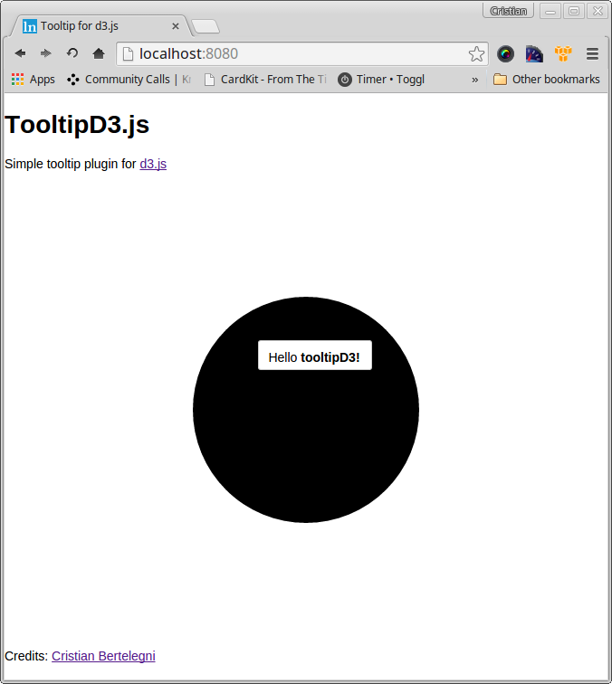

# Tooltipd3js

Tolltipd3 is a basic [d3.js](https://github.com/mbostock/d3) plugin for handling tooltips.



## Example

### HTML

```html
<style type="text/css">
svg { margin: 0 auto; display: block;}

.tooltipd3 {
	background:#FFFFFF;
	border: #ccc solid 1px;
	padding: 10px 12px 5px 10px;
	border-radius: 3px;
}
</style>
<div id="canvas"></div>
```

### JS

```javascript
var w = 500,
	h = 500;

/** instance tooltip */
var tooltip = tooltipd3();

var svg = d3.select('#canvas')
			.append('svg')
			.style('width', w)
			.style('height', h);

svg.append("circle")
	.attr('cx', function(){
		return w/2;
	})
	.attr('cy', function(){
		return h/2;
	})
	.attr('r', function(){ return w/4})

	// set mouse events
	.on('mouseover', function(){
		var html = "Hello <b>tooltipD3!</b>";
		tooltip.mouseover(html); // pass html content
	})
	.on('mousemove', tooltip.mousemove)
	.on('mouseout', tooltip.mouseout);
```

## Install

```bash
bower install -S tooltipd3
```

Credits: [cbertelegni](https://github.com/cbertelegni)
